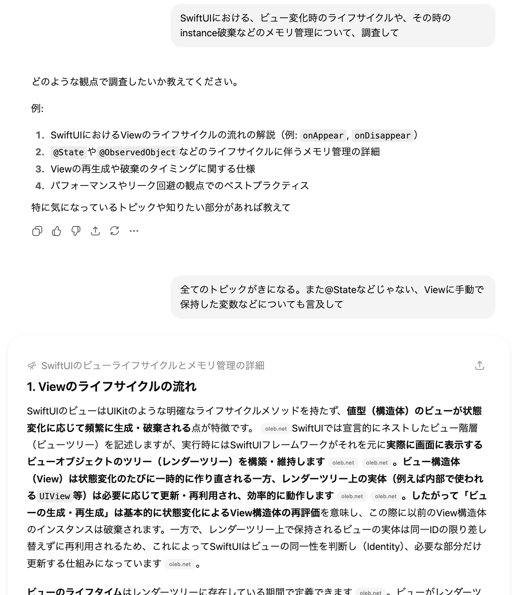
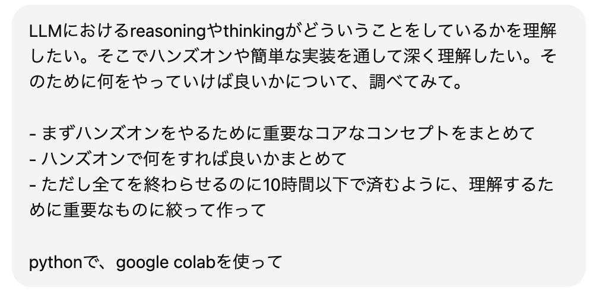

# 詳しくない分野でのVibe Codingで困ったことと学び
## 2025/09/30 shibayu36

---

# 自己紹介

- shibayu36
- ブログをよく書いています
    - [https://blog.shibayu36.org/](https://blog.shibayu36.org/)
- メインはサーバーサイドエンジニア

---

# 今日話すこと

- Vibe Codingで、サーバーサイドエンジニアが経験のないiOSアプリを作った
- その中で困ったことと学びを紹介

---

# 初iOSアプリ開発のきっかけ
* その日やる気を出すためだけのシンプルなTODOアプリが欲しかった
* Vibe Codingによって、開発経験のないiOSアプリも簡単に高速に開発できるのでは？

---

# 実際に作ってリリースした！
* [Daily Do](https://apps.apple.com/jp/app/daily-do-%E4%BB%8A%E6%97%A5%E3%81%AEtodo%E3%81%AB%E9%9B%86%E4%B8%AD%E3%81%97%E3%82%88%E3%81%86/id6747943242)
* AIをフル活用し、Vibe Codingで作り切れました

---

# 詳しくない分野でも簡単だった？ 困らなかった？

<!-- {"layout": "section_blue"} -->

---
# 簡単ではない！困りまくる！ とにかく騙される！

<!-- {"layout": "section_white"} -->

---
# どのように騙されたか

<!-- {"layout": "section_white"} -->

---

# 1. 毎回一貫性のないアーキテクチャを提案される

- コード生成ごとに違う方法を提案される
    - Viewだけで気合いでやる
    - やりすぎなClean Architecture
- 基礎知識がないので判断つかない

---

# 2. 古いやり方を提案される

- データバインディングとして、最近はObservableがよく使われる
- しかし、古いObservableObjectを提案される
- 基礎知識がないので気づかない

---

# 3. 問題に対して間違った対処を提案される

- iCloud同期が本番でだけうまくいかない問題
- このファイルのこの行を消すとうまくいくと提案
- 消してみるとすべてが動かなくなる
- 基礎知識がないので明らかにおかしい対応に気付けない

---

# 回り道をして、 結局多くの時間を取られている...

<!-- {"layout": "section_white"} -->

---

# 困ってみての学び

<!-- {"layout": "section_blue"} -->

---

# 0->1を作るための基礎知識だけは学ぶしかない

- Vibe Codingは真似は得意だが、0->1は不安定で騙されやすい
- 大変でも基礎知識は時間をとって学ぶ
- たとえば
    - 良いアーキテクチャ
    - 今使うべき公式API
    - linterなどツールチェイン

---

# 幸い、AIの力で高速に基礎知識は学べる

<!-- {"layout": "section_white"} -->

---

# 自分専用書籍を作る

- Deep Researchで特定の領域の詳しいまとめを作らせる
    - 例: SwiftUIのViewのライフサイクルを知りたい
- 本を何冊か読むよりピンポイントに学べる

<!-- {"layout": "title_body_vertical_img"} -->

---

# 自分専用ハンズオンを作る

- 手を動かして高速に学ぶため、[専用ハンズオンを作る](https://blog.shibayu36.org/entry/2025/05/13/193000)

<!-- {"layout": "title_body"} -->

---

# 基礎さえ理解すれば高速になる

- 基礎は頑張るしかないが、
- 基礎さえ理解できていれば、AIをコントロールし、結果的にVibe Codingが高速になる
    - CLAUDE.mdで、理解したアーキテクチャを指示
- 一度やれば同じ分野は一瞬に

---

# まとめ

<!-- {"layout": "section_blue"} -->

---

# まとめ

- 詳しくない分野でのVibe Codingでは、言われているほど簡単でなく、回り道が多かった
- 基礎知識だけは学ぶしかないが、AIを使って高速に学べる
- 基礎さえ理解すればAIをコントロールし、高速に開発できる
- Vibe Codingを扱うために、最初は基礎に時間をかけましょう

---

# Any Questions?

<!-- {"layout": "section_blue"} -->
