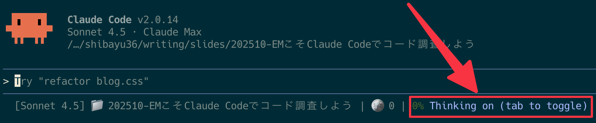
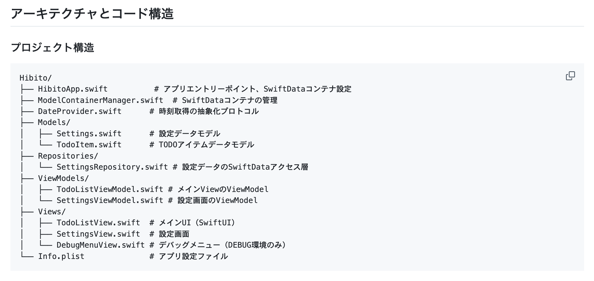
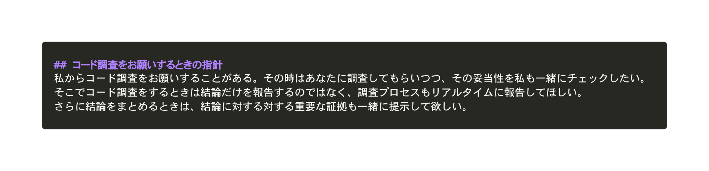

# EMこそClaude Codeで コード調査しよう
## 2025/10/20 shibayu36

---

# 自己紹介

- shibayu36
- ブログをよく書いています
    - [https://blog.shibayu36.org/](https://blog.shibayu36.org/)

---

# 開発チームを持つEMは、 他チーム・他職種から質問を 受けることが多いですよね

<!-- {"layout": "section_white"} -->

---

# 回答する時どうする？

- 詳しそうなエンジニアに聞く
- 自分でコードを読んでみる
- Claude Codeやcodexを活用して調査する

---

# 質問が来たら、 EMこそClaude Codeでコード調査しよう

<!-- {"layout": "section_blue"} -->

---

# 大前提: EMに質問が来る時の傾向

- 6~7割の精度での回答で良いことが多い
- 素早く大量に回答することが多い

---

# コーディングエージェントと相性が良い

- EMへの質問傾向とコーディングエージェントのコード調査は相性がいい
- Claude Codeによる調査の特性
    - 完璧な調査は難しいが
    - 6~7割くらいの精度の高速なコード調査ができる

---

# 例: ブログの予約投稿って、その時刻ぴったり投稿できるの？

- (1) 調査するためのプロンプトへ調整する
    - ブログの予約投稿はどのような仕組みで実装されている？
    - 予約投稿でどの程度遅れうる？
- (2) Claude Codeへ質問を投げておく
- (3) 調査結果をもとに実コードを見て正当性チェック
    - 自分でチェックが難しければ詳しい人へ。調査情報で的確に再質問できる
- (4) 調査内容を組み合わせて質問者に回答

---

# 工夫次第でコード調査精度も段違いに

<!-- {"layout": "section_blue"} -->

---

# 工夫次第でコード調査精度も段違いに

1. Thinkingモードで調査
2. ディレクトリ構造などのドキュメントを必ず用意
3. ダブルチェックしやすいCLAUDE.mdを整備

---

# Thinkingモードで調査
- ONにするだけで明らかに精度が上がる

---

# ディレクトリ構造などのドキュメントを必ず用意
- 全体の構造を教えて探索精度を上げる

<!-- {"freeze": true} -->

---

# ダブルチェックしやすいCLAUDE.mdを整備

- 自分でダブルチェックしたい
- プロセスや証拠を必ず提示させておく

---

# まとめ

<!-- {"layout": "section_blue"} -->

---

# まとめ

- コーディングエージェントは6~7割精度の調査が得意
- 6~7割の精度の大量回答をするEMこそClaude Codeでコード調査しよう
- 工夫をして調査精度も上げよう
