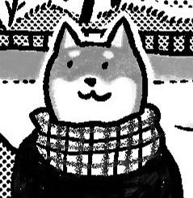
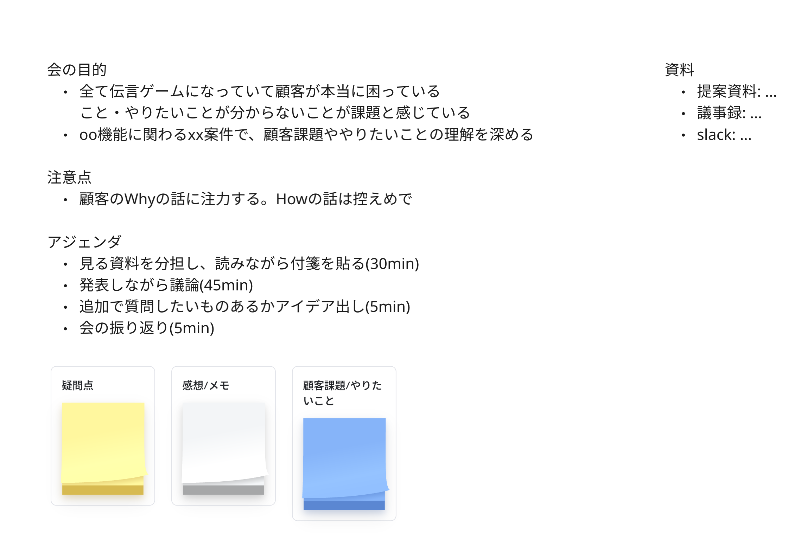
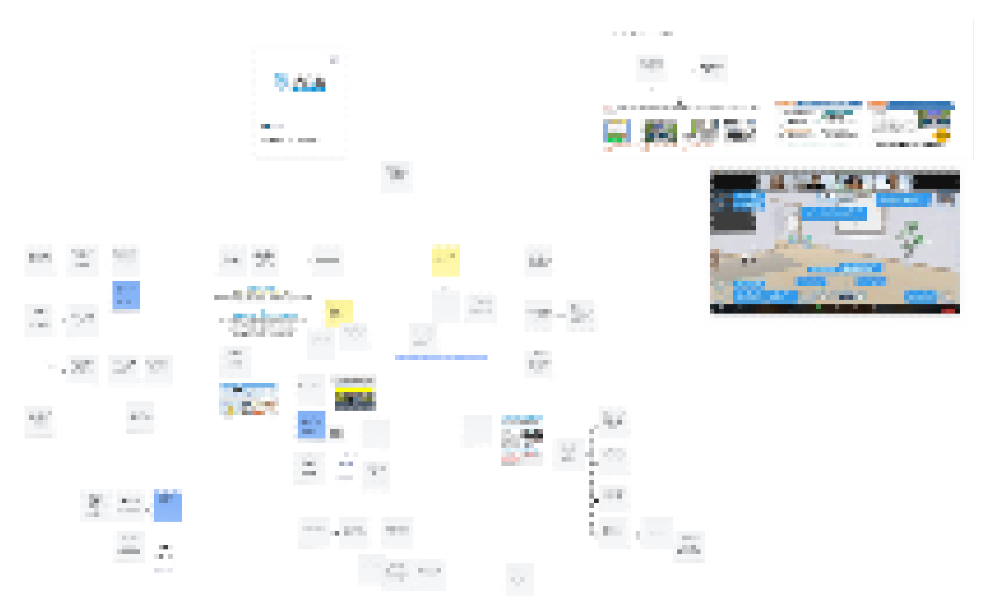
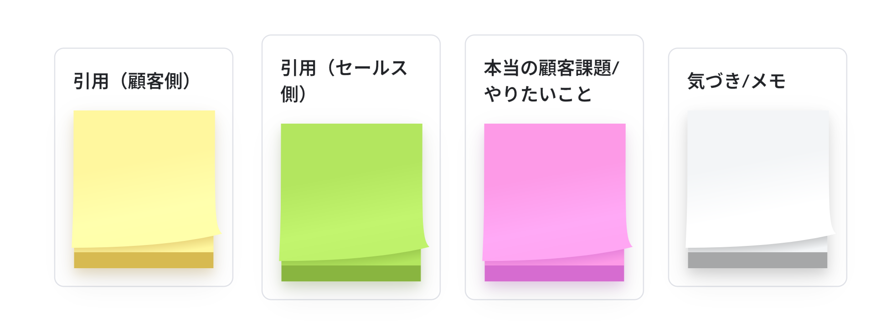

# 顧客との商談議事録をみんなで読んで顧客解像度を上げよう
## 2026/02/02 京都アジャイル勉強会 shibayu36

---
# 自己紹介
- shibayu36
- 最近はエンジニア/EM/サブPMの兼業っぽい感じ
- プロダクト価値/事業価値含む開発生産性に興味がある

---
# 今日のお話
- 開発チームが顧客解像度を上げられるようにしたい
- 顧客との会話が苦手な人でも出来るように会を立ち上げた

---
# 法人顧客の声を集めたい機運が高まった
- 一般ユーザーメインのサービス & 一般ユーザーの声を聞くことが中心だった
- 法人顧客の声も混ぜて顧客解像度を上げて開発したい
- やり方が分からない...🤦

---
# まずは自分でやってみた
- セールスメンバーと積極的に話す
- セールスと顧客の録画や議事録を見る
- 展示会についていって顧客と話してみる

---
# 自分の事例をもって他の人にもやってもらった
- 一部メンバーに展示会に行ってもらえたが、課題あり
    - 全員やるのは時間がかかる
    - 顧客と話すのが苦手な人に無理にやらせられない
- 苦手な人も含めて全員がコスパ良く顧客解像度を上げられた方がベスト
- どうする？

---
# 顧客との商談議事録をみんなで読んで議論する会を立ち上げ
- ある機能開発が入った時、法人顧客に関わるものなら会を開く
- 1時間半で、その場で議事録読み&議論まで行う

---
# 会のアジェンダ
<!-- ここにアジェンダの画像 -->

---
# 会終了後のボードの様子
<!-- ここに全部終わった付箋の画像 -->

---
# 今のところ評判がいいので続けたい
*”この機能が​どう​将来に​繋がるか​あまり​ピンと​来ていなかったが、​バックグラウンドを​知ったうえで​会話を​すると、​より​未来を​見据えた​話が​できた​”*

*”エンジニア間で対象案件の経緯やニーズ、課題点など普段あまりキャッチアップできていない部分への理解を深められた”*

---
# 会の改善ポイント
- お客さんの声そのものなのか、付箋を貼った本人の意見なのかが混ざってしまった
- 今後はユーザーインタビューの知見を生かして付箋を使い分けたい
- 参考
    - [カスタマーマニアになろう](https://speakerdeck.com/tumada/kasutamamanianinarou)
    - [料理をつくる人はどんな課題を抱えているのか？ 〜ユーザーの課題を施策につなげるインタビューの取り組み〜](https://techlife.cookpad.com/entry/2018/04/20/090000)

